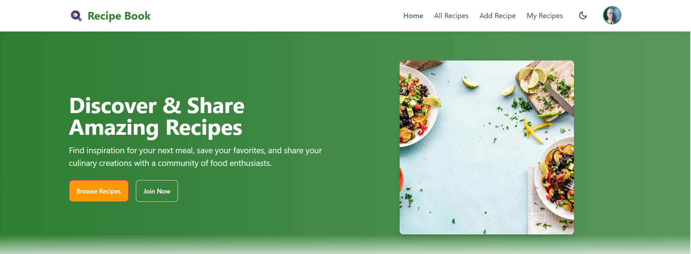
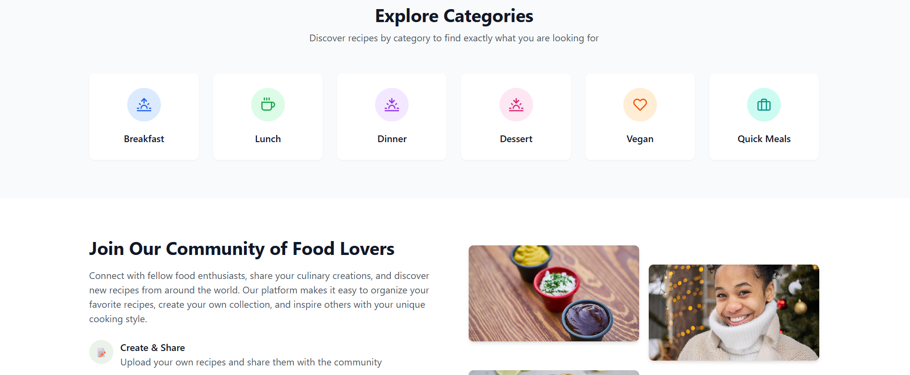

# 🍽️ Recipe Book App

🔗 **Live Site**: [https://recipe-appfrontend.vercel.app](https://recipe-appfrontend.vercel.app)

🥗 **Recipe Book App** – A modern and responsive recipe manager built with **React**, **Firebase**, and **MongoDB**. Add, edit, like, and explore recipes in a seamless experience.


## 📸 Screenshot




## 🛠️ Technologies Used

- **React**
- **Firebase Authentication**
- **React Router DOM**
- **React Hook Form**
- **Tailwind CSS**
- **DaisyUI**
- **MongoDB (backend)**
- **React Hot Toast**
- **React Icons**
- **Lottie Animations**


## ✨ Key Features

- 🔐 **Firebase Auth** – Google & email/password login
- 📝 **Recipe CRUD** – Create, edit, delete recipes (with images, category, etc.)
- ❤️ **Like System** – Real-time updates (no self-likes)
- 🔍 **Cuisine Filter** – Browse recipes by cuisine (Indian, Italian, etc.)
- 🌙 **Dark/Light Mode** – Theme toggle using Tailwind's dark mode
- 📊 **Top Recipes** – Sorted by like count using MongoDB
- 🎨 **Smooth Animations** – Lottie, Typewriter effect, and scroll-based reveals
- 📱 **Responsive Design** – Mobile, tablet, and desktop support


## 📦 Frontend Dependencies

| Package              | Version      |
|----------------------|--------------|
| **react**                | ^18.3.1      |
| **react-dom**            | ^18.3.1      |
| **react-router-dom**     | ^6.21.1      |
| **react-hook-form**      | ^7.49.2      |
| **firebase**             | ^10.7.1      |
| **daisyui**              | ^4.5.0       |
| **tailwindcss**          | ^3.4.0       |
| **react-hot-toast**      | ^2.4.1       |
| **react-icons**          | ^4.12.0      |
| **vite**                 | ^5.4.2       |
| **eslint**               | ^9.9.1       |
| postcss, autoprefixer, etc. – for CSS tooling |


# 📦 Recipe Book Backend API

🔗 **Live API**: [https://recipe-appbackend.vercel.app](https://recipe-appbackend.vercel.app)

This is the backend API built with **Node.js**, **Express.js**, and **MongoDB (Mongoose)** for the Recipe Book App. It provides a clean, modular **RESTful API** for managing recipe data and supports secure environment configuration, CORS handling, and production deployment via **Vercel**.

---

## ⚙️ Backend Features

- 🛠️ **Express.js REST API** with modular file structure
- 🍃 **MongoDB Atlas** integration via Mongoose
- 🔐 **Environment Variables (.env)** to manage Mongo URI
- 🌐 **CORS configured** for local and production clients
- 📁 **Flexible Recipe Model** (schema-less for prototyping)
- 🔄 **Full CRUD Operations**:
  - `GET /recipes` – Fetch all recipes
  - `GET /recipes/:id` – Fetch single recipe
  - `POST /recipes` – Add a new recipe
  - `PUT /recipes/:id` – Update a recipe
  - `DELETE /recipes/:id` – Delete a recipe
  - `PATCH /recipes/:id/like` – Like or unlike a recipe

🚫 **Note**: Password/auth logic is handled via Firebase (frontend). Backend stores only recipe data.

---

## 🧑‍💻 Run Locally

**1️⃣ Clone the Repository**
```bash
git clone https://github.com/your-username/recipe-book-app.git
cd recipe-book-app

2️⃣ 📦 Install Dependenciesbash
npm install

3️⃣ 🔐 Set up Firebase Config
Create a .env file in the root directory and add your Firebase credentials:
VITE_apiKey=your_api_key
VITE_authDomain=your_auth_domain
VITE_projectId=your_project_id
VITE_storageBucket=your_storage_bucket
VITE_messagingSenderId=your_messaging_sender_id
VITE_appId=your_app_id
📝 Note: Never commit your .env file. Add it to .gitignore.

4️⃣ 🚀 Run the Development Server
npm run dev

5️⃣ 📦 Build for Production
npm run build

🔗 Links & Resources
🌐 Live Site: https://recipe-appfrontend.vercel.app

📁 Client GitHub Repo: b11a10-client-side-NaimaNITU

🔥 Firebase Docs: https://firebase.google.com/docs

🍃 MongoDB Docs: https://www.mongodb.com/docs


🔄 Multiple Repo Push Setup
To push the same code to multiple repositories:
git remote set-url --add --push origin https://github.com/Programming-Hero-Web-Course4/b11a10-client-side-NaimaNITU.git

❤️ Feel free to fork, clone, and contribute to enhance this app further!
